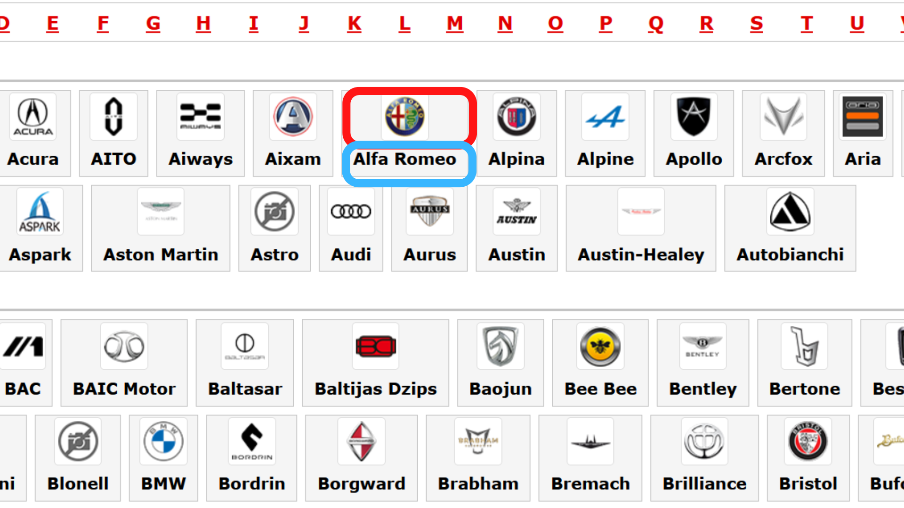
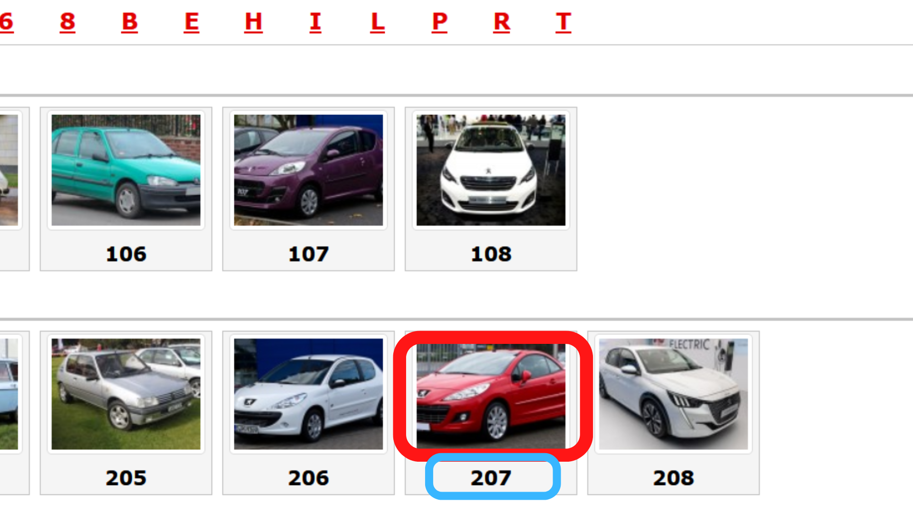
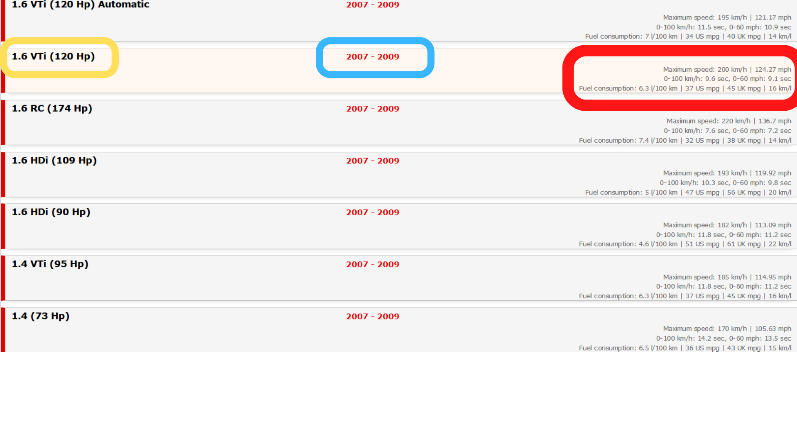
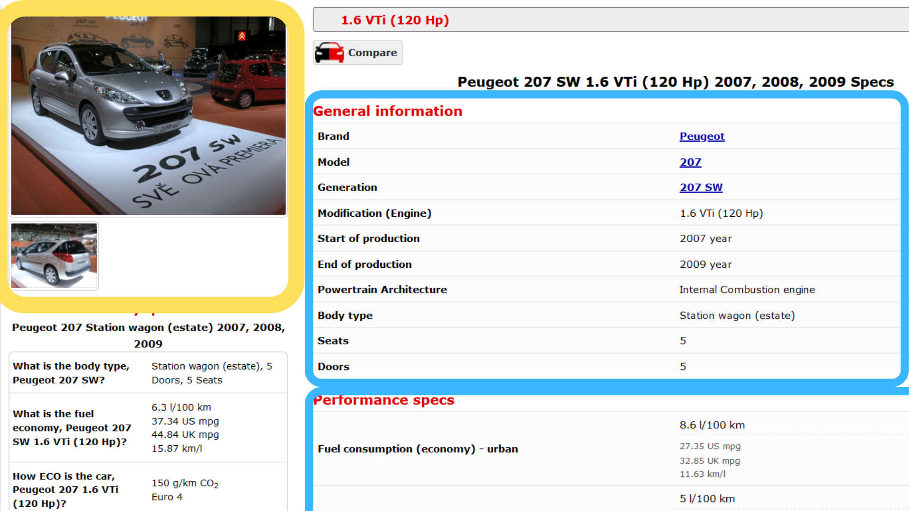
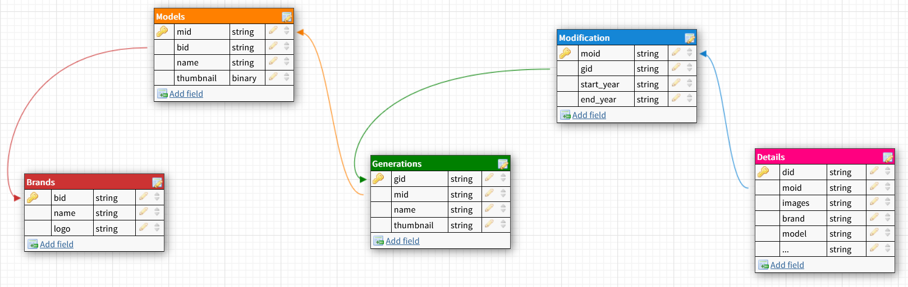

# README

---

# How it works?

 

- Install the requirements :

```python
pip install requirements.txt
```

- Start the script :

```python
scrapy crawl cars_details --nolog
```

# What data was collected?

The database has 5 tables gathered from 5 web pages, each of which represents a page that the user would go through to reach the details page, as detailed further below.

- **Table 1** : named Brands , extracted name and logo



---

- **Table 2**: named Models, extracted name and thumbnail



---

- **Table 3**: named Generations, extracted name, thumbnail, start year, end year, body type, details

.png)

---

- **Table 4**: named Modifications, extracted name, start year, end year, details



- **Table 5**: named Details, extracted all the details



---

**General Database Schema :**

